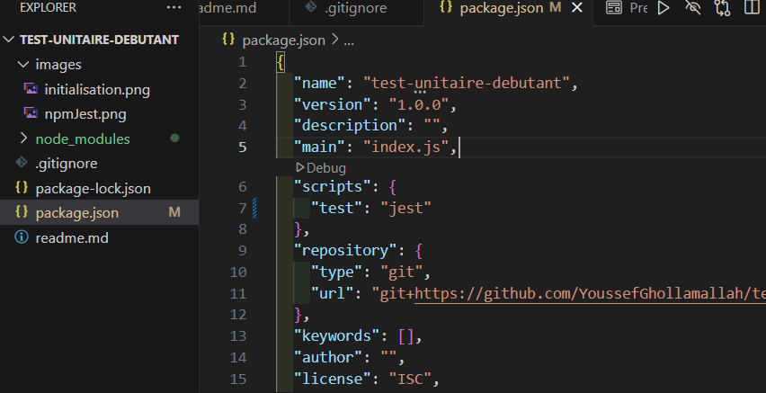

# Les Tests Unitaires 

Dans ce projet, je vais faire mes premiers tests unitaires avec Jest une librairie JavaScript développée par Meta


## Instruction :

### Etape 1: Création du projet

- Créer un dossier nommé "test-unitaire-debutant"
- Ouvrez le dans votre IDE et lancer le terminal.

### Etape 2: Initialiser un projet Node.js

- Entrez la commande suivante comme dans l'image :
- 

### Etape 3: Installation de Jest

- Dans cet étape, faudra installer Jest
- 


### Etape 4: Configuration

- Dans cet étape, nous allons configurer le fichier package.json pour validez la commande de test
- 


### Création d'une fonction d'addition

- Créer un fichier math.js et créer une fonction addition qui retourne la somme de deux nombres et affiche le résultat.

- 


### Création d'un test unitaire

- Créer un fichier math.test.js et mettre en place un script de test pour vérifier la function addition 

- importer le fichier math.js et appeler la function addition

- 

- une fois le test créer vous pourrez lancer le test avec la commande suivante dans le terminal de votre IDE:

```
npm test
```

- vous aurez des résultat par la suite comme celui si tous fonctionne bien :

- 

